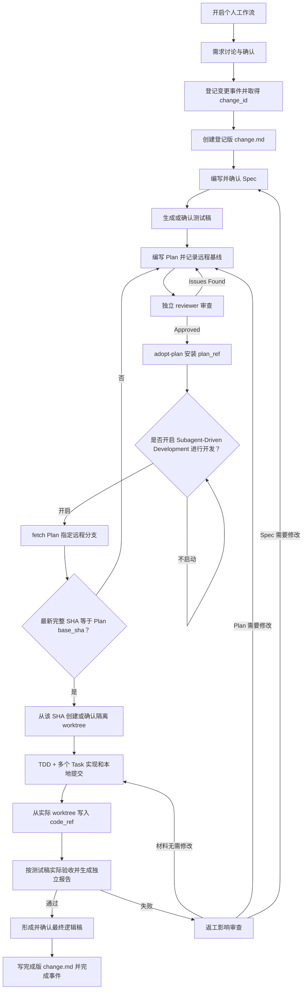

# Personal Development Workflow

这是一个面向 Codex 的个人开发工作流包。它把需求确认、变更登记、Spec、测试稿、Plan、TDD 实现、验收和返工串成一条可恢复、可追踪的流程。

本仓库只包含六个定制 Skill。Superpowers 原生 Skill 是外部只读依赖，本仓库不复制、不修改它们。

## 包含的 Skill

- `using-personal-development-workflow`：总控、游标监督和阶段路由。
- `managing-change-ledger`：项目级 SQLite 总账、`change_id`、材料引用和游标持久化。
- `exploring-and-grilling-requirements`：需求讨论与确认。
- `writing-specs`：已确认行为契约和既有功能影响。
- `writing-test-drafts`：验收测试稿、实际验收报告和失败回传。
- `writing-final-logic-drafts`：验收通过后的轻量最终逻辑稿。

外部依赖见 [DEPENDENCIES.md](DEPENDENCIES.md)。

## 完整流程



主线顺序是：

```text
开启工作流
→ 需求讨论与确认
→ 登记 change_id / 创建 change.md
→ 编写并确认 Spec / 生成测试稿
→ 编写、独立评审并采用 Plan
→ 询问是否开启 SDD
→ fetch Plan 指定远程分支并核对最新完整 SHA
→ 从该 SHA 建立 worktree + TDD + 实现与本地提交
→ code_ref
→ 实际验收与独立报告
→ 形成并确认最终逻辑稿
→ 完成 change.md / 关闭事件与游标
```

## 身份、材料与版本

一个工作流游标绑定一个变更事件。所有正式材料共用总控提供的同一个 `change_id`：

```text
changes/<change_id>/change.md
specs/<change_id>.md
plans/<change_id>.md
tests/<change_id>.md
acceptance/<change_id>/<run>.md
logic/<change_id>.md
```

版本不靠另建文件名区分，而由 `路径@完整 Git SHA` 定位。最终逻辑稿不增加 SQLite 字段；它由最终 `change_ref` 的同一 Git commit SHA 锁定，派生定位为 `logic/<change_id>.md@<final-change-ref-sha>`。

一个 Plan 对应一个工作流任务和一个变更事件；一个 Plan 内部可以拆成多个 Task。多个 Task 共享同一份 Spec、Plan、代码快照和完成边界，不为每个 Task 新建事件。

`change.md` 只写两次：

1. 事件登记时创建，记录背景、分类、影响范围、Spec 处理和确认结论。
2. 事件完成时更新，记录 `status: completed`、最终材料引用、`logic/<change_id>.md` 的 canonical 路径和最终结论。

中间阶段只更新项目级 SQLite 中的当前材料引用，不持续重写 `change.md`。

## 项目配置与 SQLite

每个项目使用自己的 `.codex/personal-development-workflow.json` 和项目级 SQLite，不存在用户级全局配置 fallback。总控从当前目录向上查找最近的一份项目配置。

复制示例后，把占位符改为该项目已经确认的绝对路径：

```powershell
Copy-Item examples/personal-development-workflow.json.example <project-root>/.codex/personal-development-workflow.json
```

配置字段：

- `spec_vault`：保存正式变更材料并提供 Git SHA 的 Git 仓库。
- `database`：必须位于 `spec_vault/.local/`，并被 Git 忽略。
- `repositories`：稳定仓库名到实际非 bare Git checkout 的映射。

真实项目配置、`.local/` 和 SQLite 不应提交到本仓库或业务仓库。

SQLite 继续只保存既有六类材料引用和工作流游标，不增加 `logic_ref` 或新的工作流阶段。`complete` 从最终 `change_ref` 的 SHA 读取同一提交中的逻辑稿并机械验证。

## Plan 与实现门禁

Spec 和测试稿就绪后，使用外部原生 `writing-plans` 形成 Plan。Plan 必须记录 `base_remote`、`base_branch` 和评审代码所用的 40 位完整 `base_sha`，经过独立 reviewer，并由 `managing-change-ledger adopt-plan` 原子安装新的 `plan_ref`；只有采用成功后才进入 `tdd_coding`。

进入编码前，总控必须逐字询问：

> 是否开启 Subagent-Driven Development 进行开发？

只有当前对话中的明确肯定才授权先 fetch Plan 指定的远程基线分支、创建或进入隔离 worktree、按当前 Plan 编码，并在该范围创建本地 commits。fetch 只更新本地 remote-tracking ref，不会对远程写入，也不会 pull、merge 或 reset 主 checkout。

fetch 后必须解析远程分支的最新完整 SHA。它与 Plan `base_sha` 一致时，才从该 SHA 创建或确认 worktree；不一致时立即关闭代码门，只审查这段远程差异，最小更新并重新评审 Plan。fetch 失败或材料重新采用前，不得创建开发 worktree、写 RED/测试/代码或创建本地 commit。该授权始终不包含 push、PR、merge、清理或 branch finishing。

## 验收失败与返工

验收失败保留原失败报告并停留在同一个 `in_progress` 事件。总控先读取当前正式 `spec_ref` 和 `plan_ref`，执行返工影响审查，分别判断 Spec 和 Plan 是“无需修改、局部修改、结构性修改”。

责任阶段按最早拥有问题的位置决定：

- Spec 与 Plan 都无需修改：回到 TDD 做最小修复。
- 只有 Plan 需要修改：回到 Plan，定点修改、重新 review 和采用。
- Spec 需要修改：先回到 Spec，确认行为后再审查受影响的 Plan。

硬规则是先改正式材料，再改代码。只要 Spec 或 Plan 需要修改，代码门立即关闭：不继续修改生产代码或测试代码、不启动实现编排器、不创建代码 commit、不更新 `code_ref`。已经存在的代码 diff 冻结但不自动删除；新 Plan 采用后再按新材料和实际 worktree diff 复核，并重新取得 TDD/授权门禁。

这是一条由总控、执行代理和总账引用共同执行的工作流合同，不是操作系统级 Git hook。总账会阻止错误阶段写入 `code_ref`，但无法阻止用户绕开工作流直接运行原生 `git commit`；遵守本流程时不得用手工 Git 命令规避材料门禁。

## 验收通过后的最终逻辑稿

验收报告由唯一 validator 判定全部通过后，总控先调用 `writing-final-logic-drafts`，根据当前不可变 Spec、已评审 Plan、最终代码和验收事实形成 `logic/<change_id>.md`。候选稿必须完整展示并取得用户确认；等待确认期间仍停在 `acceptance`，不修改数据库阶段，也不完成事件。

逻辑稿的正常粒度是：先讲核心机制，再按真实顺序讲用户触发、系统处理、页面或状态结果，以及理解流程所需的关键顺序、层级、重复触发或清理行为。文档使用必填的 `## 功能逻辑` 和可选的 `## 注意事项`；不写函数、文件清单、逐项测试证据，也不强制拆成多个固定栏目。

完成时，最终 `change.md` 的 `## 最终逻辑稿` 章节只记录 `- logic/<change_id>.md`。最终 `change_ref` 指向的同一 commit tree 必须同时包含这两份文件；缺失、空壳、身份错误或路径不一致时，`complete` 保持事件为 `in_progress`。

## 安装

先确保 [DEPENDENCIES.md](DEPENDENCIES.md) 中的外部 Superpowers Skill 已安装，然后在仓库根目录运行：

```powershell
pwsh -NoProfile -File scripts/install.ps1
```

默认目标是当前用户的 `.codex/skills`。指定其他 Skill 根目录：

```powershell
pwsh -NoProfile -File scripts/install.ps1 -DestinationRoot '<absolute-skill-root>'
```

目标中已有任一定制 Skill 时，安装器默认拒绝覆盖。确认需要替换时显式使用 `-Force`；旧目录会先备份到目标根的 `.personal-development-workflow-backups/<UTC timestamp>/`。

安装器不会创建项目配置、数据库、变更材料或远端资源。

## 测试

在仓库根目录运行：

```powershell
pwsh -NoProfile -File scripts/test.ps1
```

测试覆盖包边界、安装安全、六个 Skill 的合同与脚本、Python 编译，以及发布副本的路径可移植性。

## 安全边界

- 不提交真实项目配置、SQLite、`.local`、凭据或本机绝对路径。
- 不把 Superpowers 原生 Skill 源码复制进本仓库。
- 不由安装器修改既有 Skill，除非用户显式使用 `-Force`。
- 工作流中的本地 commit 授权不自动扩大为 GitHub/GitLab 远端操作授权。
